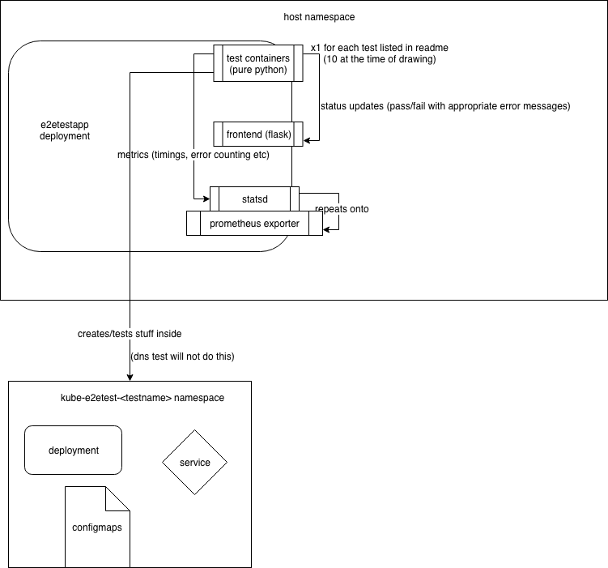

# Contributing
We welcome new contributors to this project. To get started we recommend checking out and commenting on the issues, or raising a new one if you find a bug and/or would like to write a new feature.

## Style & Quality
The platform team at Ocado Technology follows the [angular commit message style](https://github.com/angular/angular/blob/master/CONTRIBUTING.md#rules) - contributors should stick to those commit types.

Testing this sort of thing is difficult and leans more toward integration testing than unit testing in general - there are some unit tests in `./tests` which mostly cover the frontend which is much easier to mock out and test individually. We'd especially appreciate contributions here.

## Design/Architecture
The following diagram explains how the app works and should give some insight into adding new tests:

Some points which are harder to explain through a diagram:
1. Wherever tests are checking functionality rather than creation, they should create new resources the first time and leave them there for future tests. E.g the service test is checking kubernetes can create a service, so should create, check and delete it, but the deployment service test is checking services and deployments can effectively work together, so should only create resources if it does not already exist.
1. The app uses statsd because the prometheus client library would create a new prometheus server on every container - this would mean having to have a lot more service monitors/service configuration than really necessary. Using statsd enables each container to push metrics to it and have statsd dedupe the results.
